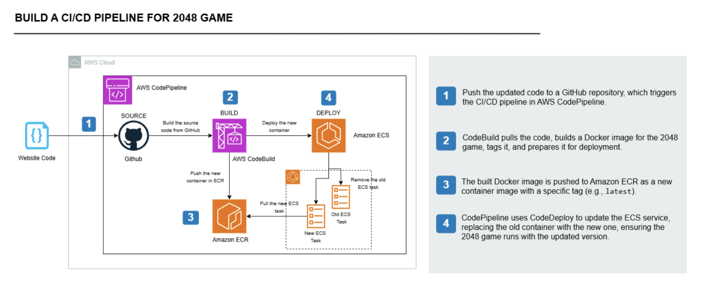

# 🎮 2048 Game – CI/CD on AWS (CodePipeline → CodeBuild → ECR → ECS Fargate)

A **production-grade CI/CD pipeline** that builds, containerizes, and deploys the classic **2048 web game** to **AWS ECS Fargate**, with container images stored in **Amazon ECR** and builds triggered automatically from **GitHub pushes** using **AWS CodePipeline** and **CodeBuild**.

---

## 🌐 Live Demo
Deployed to an ECS Fargate task with a public IP (HTTP:80).

**Source Repository:**  
🔗 [https://github.com/Arjunpuram22/2048-game-ci-cd](https://github.com/Arjunpuram22/2048-game-ci-cd)

---

## 🧭 What I Built

- 🧱 **Containerized** a static Nginx site (the 2048 game) with a simple Dockerfile  
- 🚀 **Pushed** Docker images to **Amazon ECR**  
- ☁️ **Deployed** the container on **ECS Fargate** (serverless containers)  
- 🔁 **Automated** the full deployment lifecycle via **AWS CodePipeline**:
  - **Source:** GitHub repository (this one)  
  - **Build:** CodeBuild executes `buildspec.yml`, builds & pushes Docker image to ECR  
  - **Deploy:** CodePipeline deploys to ECS using `imagedefinitions.json`  
- 🔄 Every Git push to `main` branch automatically redeploys the latest version

---

## 🖼️ Architecture



✅ Prerequisites

Before deploying, ensure you have:

- 🧑‍💻 **AWS Account** with IAM permissions for ECR, ECS, CodeBuild, and CodePipeline  
- ⚙️ **AWS CLI** configured locally (`aws configure`) – e.g., region `us-east-1`  
- 🐳 **Docker Desktop** installed for local testing  
- 💾 **GitHub repository** (this one) connected to AWS CodePipeline  
- 🏗️ **ECR repository** (e.g., `2048-game-repo`)  
- ☁️ **ECS cluster & Fargate service** configured to run container (port 80)

> **Security Note:** Avoid committing your AWS account ID or public IPs in a public repo.  
> Use IAM roles and environment variables for sensitive configurations.

---

## 🧱 Dockerfile (Nginx)

> Uses **AWS Public ECR Nginx** image to avoid Docker Hub rate limits.

```dockerfile
# Use AWS public ECR Nginx base image
FROM public.ecr.aws/nginx/nginx:latest

# Copy the static website into nginx web root
COPY . /usr/share/nginx/html

EXPOSE 80
CMD ["nginx", "-g", "daemon off;"]
```

---

## 🧪 CodeBuild – buildspec.yml

This file drives the build, push to ECR, and creation of imagedefinitions.json for ECS deployment.

Replace <ACCOUNT_ID> with your AWS Account ID and ensure your ECS container name matches your task definition.

```buildspec.yml
version: 0.2

phases:
  pre_build:
    commands:
      - echo Logging in to Amazon ECR...
      - aws ecr get-login-password --region us-east-1 | docker login --username AWS --password-stdin <ACCOUNT_ID>.dkr.ecr.us-east-1.amazonaws.com

  build:
    commands:
      - echo Building the Docker image...
      - docker build -t 2048-game .
      - echo Tagging the Docker image...
      - docker tag 2048-game:latest <ACCOUNT_ID>.dkr.ecr.us-east-1.amazonaws.com/2048-game-repo:latest

  post_build:
    commands:
      - echo Pushing the Docker image to Amazon ECR...
      - docker push <ACCOUNT_ID>.dkr.ecr.us-east-1.amazonaws.com/2048-game-repo:latest
      - echo Creating imagedefinitions.json for ECS deployment...
      - printf '[{"name":"2048-container","imageUri":"%s"}]' "<ACCOUNT_ID>.dkr.ecr.us-east-1.amazonaws.com/2048-game-repo:latest" > imagedefinitions.json

artifacts:
  files:
    - imagedefinitions.json
```

---

## 🔄 Proving CI/CD in Action

To validate the end-to-end CI/CD pipeline, I performed the following steps:

1. ✏️ **Edited `index.html`** — changed the game heading to _“2048 by Arjun Puram”_ to simulate a code update.  
2. 💾 **Committed and pushed** the change to the GitHub `main` branch.  
3. ⚙️ **Observed AWS CodePipeline** automatically execute all three stages:
   - **Source** ✅  
   - **Build** ✅  
   - **Deploy** ✅  
4. 🌐 **Verified ECS Fargate task restarted** with the newly built Docker image.  
5. 🎯 **Confirmed the updated website** was live at the public IP, reflecting the latest code changes.

> Each code push automatically triggers the build and deployment process — demonstrating a fully automated CI/CD workflow.
